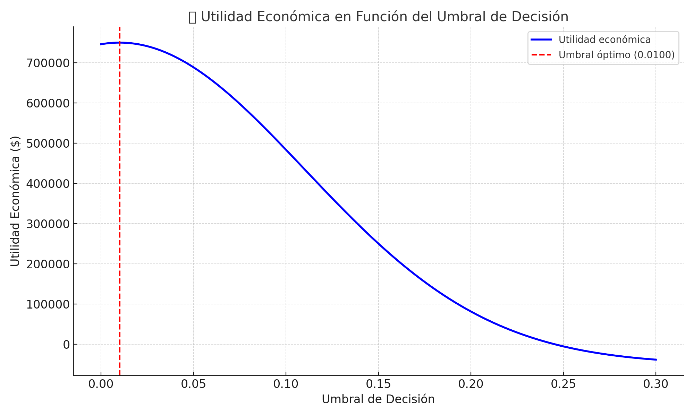

# 💼 Detección Estratégica de Fraude con Deep Learning: Maximizando la Utilidad Económica

## 🧠 Objetivo del Proyecto

Este proyecto demuestra cómo un modelo de Inteligencia Artificial puede ir más allá de las métricas tradicionales para convertirse en una herramienta estratégica que protege capital y genera rentabilidad directa para una institución financiera.

---

## 🏦 Contexto Real del Negocio

Un banco estaba perdiendo aproximadamente **$300,000 mensuales** debido a fraudes con tarjetas de crédito.  

El reto no era solo detectar fraudes, sino diseñar una solución que **tomara decisiones alineadas con los intereses financieros del negocio**.

---

## 🔍 Estrategia Aplicada

- ✅ Entrenamos una red neuronal con técnicas de regularización avanzadas (L1, L2, Dropout, Batch Normalization).  
- ✅ **Optimizamos el umbral en función de los Costos y Beneficios** reales, para que el Modelo tome las decisiones que más le convienen al cliente.  
- ✅ Aceptamos bloqueos légitimos moderados para **detectar el mayor número de fraudes**, priorizando el ahorro de capital.

---

## 📊 Resultados Clave

| Indicador                         | Antes del Modelo | Después del Modelo |
|----------------------------------|------------------|--------------------|
| Tasa de detección de fraude      | 0.17%            | **0.59%**          |
| Utilidad mensual estimada        | -$300,000        | **+$190,300**      |
| Mejora total en rentabilidad     | —                | **+$490,300**      |
| Umbral de decisión óptimo        | —                | **0.0100**         |

---

## 💡 ¿Qué lo hace diferente?

🎯 En lugar de optimizar precisión o F1-Score, este modelo fue diseñado para **maximizar el beneficio económico neto**.  

🔐 Entiende el contexto: **bloquear una transacción legítima cuesta $100**, pero **no detectar un fraude cuesta $2,500**, entonces toma las decisiones más convenientes para el banco basandose en esos datos.  

📈 Cada predicción fue tratada como una decisión de negocio, evaluando su impacto financiero real.

---

## 🧾 Herramientas Utilizadas

- Python, NumPy, Pandas, Matplotlib, scikitlearn, etc
- Keras + TensorFlow (red neuronal)
- Optimización de umbral personalizado
- Evaluación basada en matriz de costos
- Visualización de utilidad económica

---

---

## 🙋 Sobre mí

Soy un Científico de Datos con enfoque en construir soluciones de alto impacto económico, alineadas 100% con los objetivos del cliente.

Este proyecto refleja mi capacidad para aplicar inteligencia artificial no solo de forma técnica, sino estratégica, teniendo como prioridad la Inteligencia Empresarial.

📩 **Estoy abierto a nuevas oportunidades laborales en Data Science, Machine Learning o IA aplicada a negocios.**

🔗 Conecta conmigo en [LinkedIn] www.linkedin.com/in/andybussines 

📬 Contáctame directamente: andymlconsulting@gmail.com

